# GTNH Mod Hub

  
  
  
  

  面向 Minecraft 1.7.10 / GT New Horizons（GTNH）的环境增强与实用模组索引，汇总功能特性、当前版本、发布下载与源码仓库。

  <a href="#backpackenhance">BackpackEnhance</a> •
  <a href="#betterfurnacenh">BetterFurnaceNH</a> •
  <a href="#clipboardanywhere">ClipboardAnywhere</a> •
  <a href="#easytechnology">EasyTechnology</a> •
  <a href="#ingameime">InGameIME</a> •
  <a href="#tomsstoragenh">TomsStorageNH</a> •
  <a href="#版本适配">版本适配</a> •
  <a href="#安装说明">安装说明</a>

---

## 模组列表

版本与下载地址更新于 **2026-10-03**。各模组的「最新发布」链接可查看后续版本。

### BackpackEnhance

为 Minecraft 1.7.10 / GTNH 提供容器内嵌背包面板，提升物品存取与多背包协同效率。

- **悬浮面板与位置记忆**：在容器与机器界面右侧显示可拖动的背包面板，各界面独立记忆位置，支持快捷键（默认 `T`）快速折叠展开，支持滚轮平滑滚动浏览 6 行以上的大型背包。
- **多背包标签管理**：自动识别玩家背包内的各类储物装备生成标签页，支持 Adventure Backpack、Brad's Backpack 以及 Forestry 专用与标本背包，并完整遵循 Forestry 物品过滤与四种模式切换。
- **AE2 无线终端集成**：供电正常且在通信范围内的 AE2 无线物品与无线合成终端直接映射为标签页，支持总数汇总、分块数据同步与 Shift 快速存取。
- **NEI 搜索与材质适配**：搜索栏支持 NEI 语法匹配，提供槽位高亮、条目筛选与双击标签快速定位；内置独立控件材质，并提供专属 Modernity 适配包。
- **物品转移规则**：创造模式取起背包时保留鼠标上的物品；Brad's Backpack 侧栏遵循原生背包禁入规则和配置黑名单，覆盖 Shift、普通放入与拖动操作。

📸 游戏截图预览（点击展开）

 

**背包悬浮面板与外部容器对接**
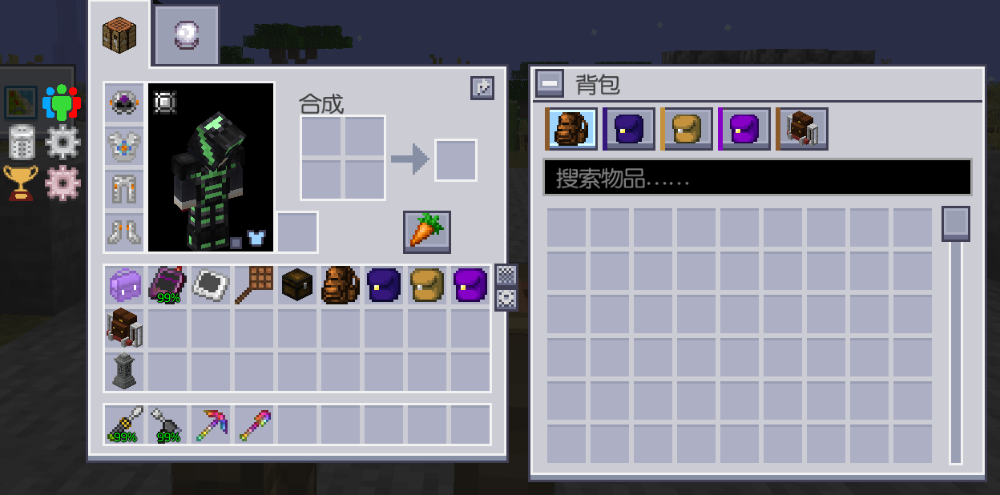

**合成站与侧边悬浮背包栏位联动交互**
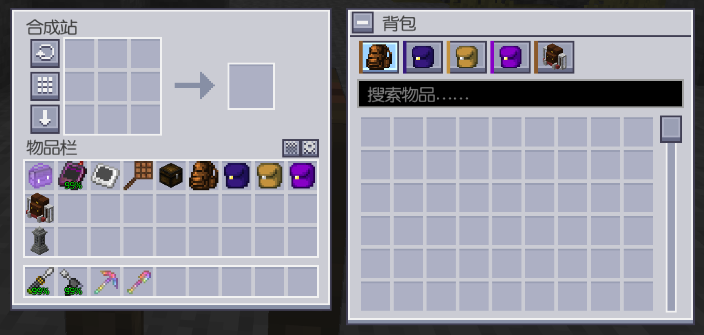

**多背包标签页切换与物品存取**
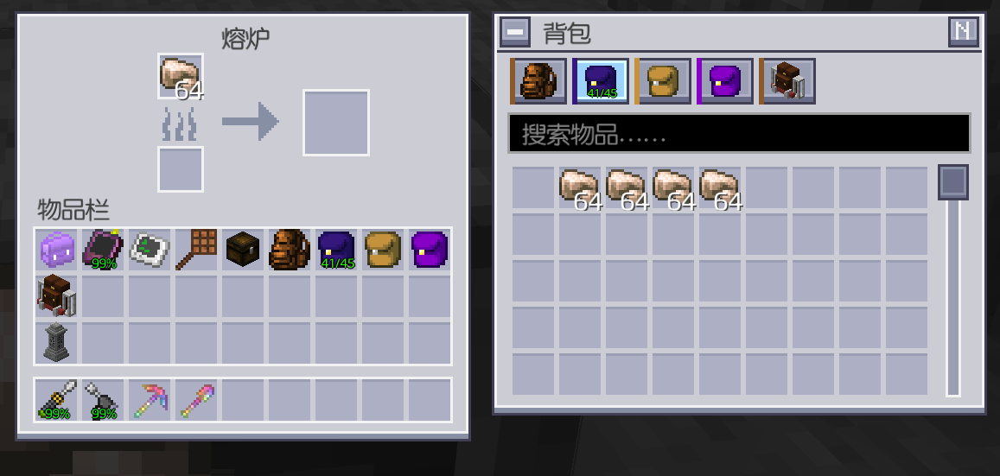

| 模组版本 | 适配 GTNH 版本 | 状态 |
| :--- | :--- | :--- |
| [0.3.2](https://github.com/liansishen/BackpackEnhance/releases/tag/0.3.2) | 2.9.0RC1 | 适配 |

> 🏷️ **当前版本**：[`0.3.2`](https://github.com/liansishen/BackpackEnhance/releases/tag/0.3.2) &nbsp;｜&nbsp; 📥 **直接下载**：[backpackenhance-0.3.2.jar](https://github.com/liansishen/BackpackEnhance/releases/download/0.3.2/backpackenhance-0.3.2.jar) &nbsp;｜&nbsp; 🎨 **材质包**：[Modernity 适配包](https://github.com/liansishen/BackpackEnhance/releases/download/0.3.2/Modernity-BackpackEnhance-0.3.2.zip) &nbsp;｜&nbsp; 🔗 **链接**：[最新发布](https://github.com/liansishen/BackpackEnhance/releases/latest) · [源码仓库](https://github.com/liansishen/BackpackEnhance)

> 联机升级到 0.3.2 时，客户端与服务端需同步更新 BackpackEnhance，以匹配新的侧栏状态数据包格式。

---

### BetterFurnaceNH

为 GTNH 添加分级熔炉体系、流体燃料驱动与紧凑漏斗自动化支持。

- **分级熔炉与高炉升级**：提供铁熔炉（1.5×）、金熔炉（2.25×）与钻石熔炉（3.375×），安装 Et-Futurum-Requiem 时可进一步升级为 2 倍速的高炉。
- **流体燃料支持**：内置可配置容量（默认 8000L）的流体槽，支持使用桶注入或管道输入岩浆与杂酚油作为燃烧动力。
- **漏斗升级组件**：由原版漏斗合成，潜行右键熔炉顶面开启自动输入、底面开启自动输出；GUI 配备开关按钮，手持 GT 撬棍支持朝向预览与拆卸。
- **材质适配**：配套提供漏斗输入/输出按钮的 Modernity 适配材质包。

📸 游戏截图预览（点击展开）

 

**强化熔炉展示**
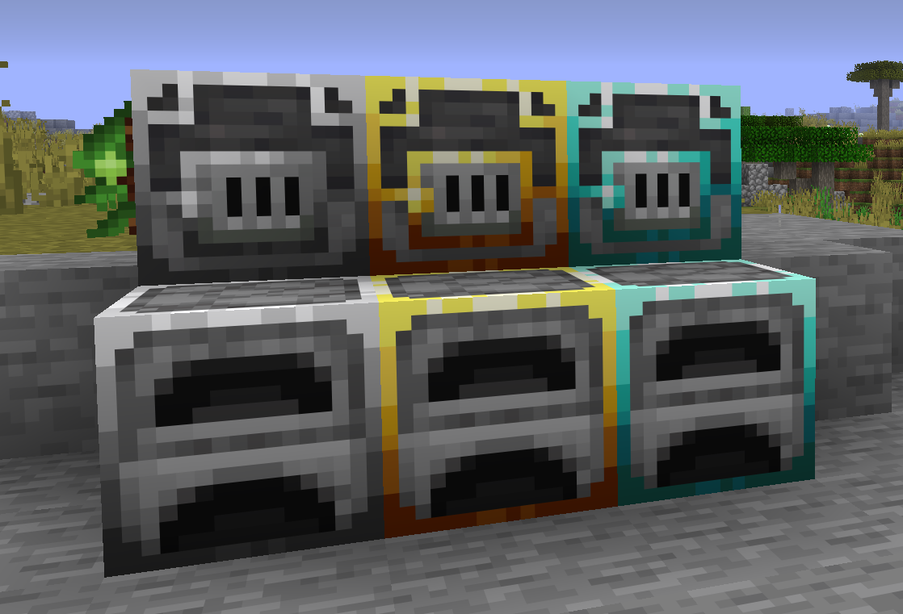

**漏斗升级自动输入输出配置面板**
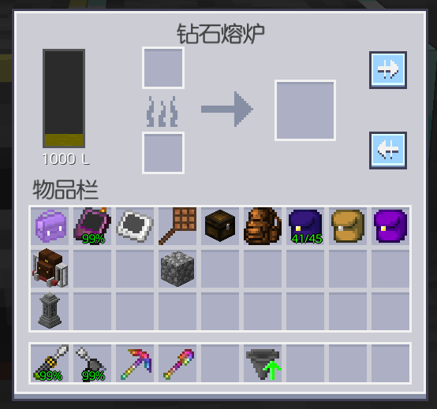

**熔炉升级插槽与配置栏**
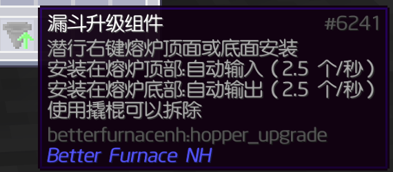

| 模组版本 | 适配 GTNH 版本 | 状态 |
| :--- | :--- | :--- |
| [0.2.3](https://github.com/liansishen/BetterFurnaceNH/releases/tag/0.2.3) | 2.9.0RC1 | 适配 |

> 🏷️ **当前版本**：[`0.2.3`](https://github.com/liansishen/BetterFurnaceNH/releases/tag/0.2.3) &nbsp;｜&nbsp; 📥 **直接下载**：[betterfurnacenh-0.2.3.jar](https://github.com/liansishen/BetterFurnaceNH/releases/download/0.2.3/betterfurnacenh-0.2.3.jar) &nbsp;｜&nbsp; 🎨 **材质包**：[Modernity 适配包](https://github.com/liansishen/BetterFurnaceNH/releases/download/0.2.3/Modernity-BetterFurnaceNH-0.2.3.zip) &nbsp;｜&nbsp; 🔗 **链接**：[最新发布](https://github.com/liansishen/BetterFurnaceNH/releases/latest) · [源码仓库](https://github.com/liansishen/BetterFurnaceNH)

---

### ClipboardAnywhere

为 BiblioCraft 写字板提供全界面悬浮窗，随时随地查阅并维护任务清单。

- **全局悬浮交互**：在 HUD 与各类容器界面显示写字板悬浮窗，支持翻页、切换任务勾选状态以及直接就地编辑任务文本（上限 23 字符）。
- **多写字板绑定**：手持写字板潜行右键空气完成绑定，支持管理多个不同任务板，可读取玩家背包或已加载区块中的放置实体。
- **离线快照缓存**：绑定的写字板所在区块卸载时自动保留只读快照，重载后自动恢复同步。
- **自由布局与兼容**：提供内置布局编辑器，支持自由拖拽、0.5×–2.0× 等比缩放、透明度调节与极简折叠模式；原生兼容 ModularUI2 与 ModernKeyBinding。

📸 游戏截图预览（点击展开）

 

**游戏 HUD 全局悬浮写字板**
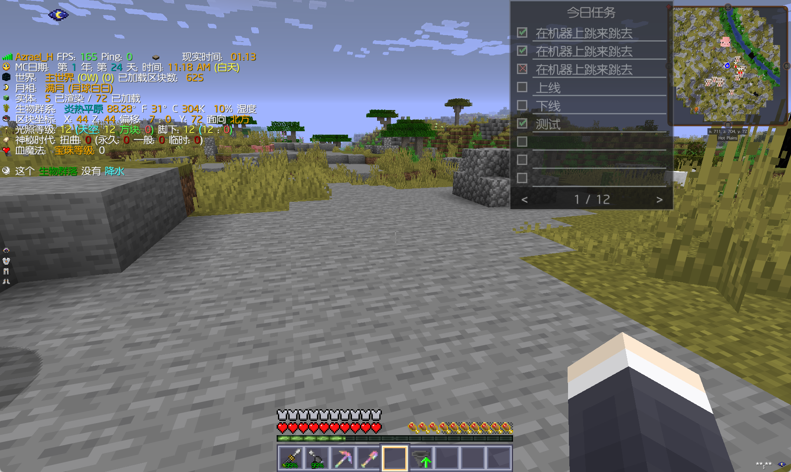

**设置界面**
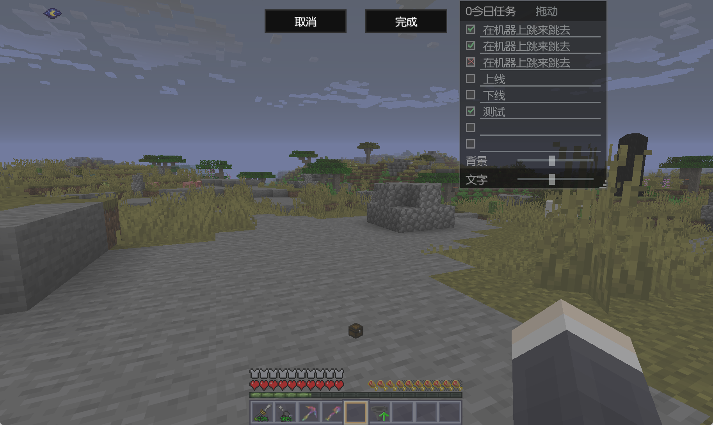

**任务清单就地编辑与勾选交互**
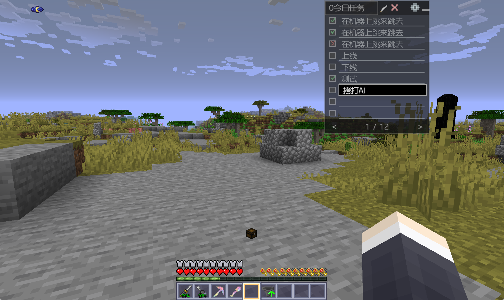

| 模组版本 | 适配 GTNH 版本 | 状态 |
| :--- | :--- | :--- |
| [0.2.2](https://github.com/liansishen/ClipboardAnywhere/releases/tag/0.2.2) | 2.9.0RC1 | 适配 |

> 🏷️ **当前版本**：[`0.2.2`](https://github.com/liansishen/ClipboardAnywhere/releases/tag/0.2.2) &nbsp;｜&nbsp; 📥 **直接下载**：[clipboardanywhere-0.2.2.jar](https://github.com/liansishen/ClipboardAnywhere/releases/download/0.2.2/clipboardanywhere-0.2.2.jar) &nbsp;｜&nbsp; 🔗 **链接**：[最新发布](https://github.com/liansishen/ClipboardAnywhere/releases/latest) · [源码仓库](https://github.com/liansishen/ClipboardAnywhere)

---

### EasyTechnology

为 GTNH 前中期自动化与资源采集提供多项实用设备与便利功能。

- **纠缠采矿系统**：纠缠卡片可记录任意方块或玩家坐标（支持跨维度），配合燃煤、蒸汽或各级 EU 纠缠采矿机实现远程矿石开采，最大工作范围达 49×49。
- **虚空采油定位**：虚空采油定位卡可记录区块坐标与地下流体信息，装入 GT 采油机控制槽即可进行跨维度远程抽油。
- **便携合成站**：随身右键或快捷键开启无需落地的匠魂合成台，支持常规合成、工具修理与强化。
- **实用增益**：包含持续恢复饱食度与饱和度的饰品栏治愈之戒；GT 多方块虚空与石油钻机运作时免除采矿管道消耗。

📸 游戏截图预览（点击展开）

 

**治愈指环**

**便携合成站**
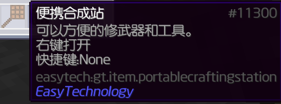

**纠缠矿机**
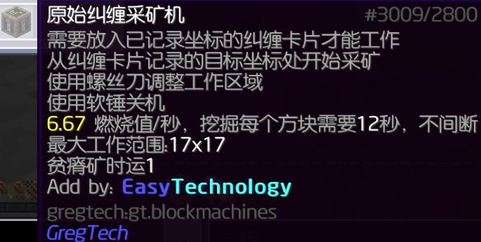

**纠缠卡片**
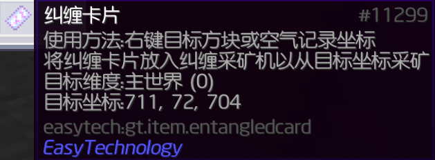

| 模组版本 | 适配 GTNH 版本 | 状态 |
| :--- | :--- | :--- |
| [0.5.3](https://github.com/liansishen/EasyTechnology/releases/tag/0.5.3) | 2.9.0RC1 | 适配 |

> 🏷️ **当前版本**：[`0.5.3`](https://github.com/liansishen/EasyTechnology/releases/tag/0.5.3) &nbsp;｜&nbsp; 📥 **直接下载**：[easytech-0.5.3.jar](https://github.com/liansishen/EasyTechnology/releases/download/0.5.3/easytech-0.5.3.jar) &nbsp;｜&nbsp; 🔗 **链接**：[最新发布](https://github.com/liansishen/EasyTechnology/releases/latest) · [源码仓库](https://github.com/liansishen/EasyTechnology)

---

### InGameIME

Minecraft 1.7.10 Forge 的客户端原生 Rime 输入法前端，在游戏内提供流畅的中文输入体验。

- **原生输入体验**：在游戏输入框光标旁实时呈现预编辑拼音与悬浮候选框，支持方案切换、中英文切换、翻页与候选注释。
- **广泛界面适配**：深度适配原版聊天与铁砧输入框，以及 NEI、AE2、ModularUI 1/2、BiblioCraft、ClipboardAnywhere 与 BackpackEnhance 搜索框。
- **全量物品索引**：内置游戏物品名称索引，支持全拼、小鹤双拼片段以及英文与数字的快速检索。
- **独立运行与依赖**：完全运行于客户端；运行需配套安装 JNA 5.14.0、系统对应架构的 librime 核心库及 Rime Ice 等方案词库。

📸 游戏截图预览（点击展开）

 

**设置页面1**
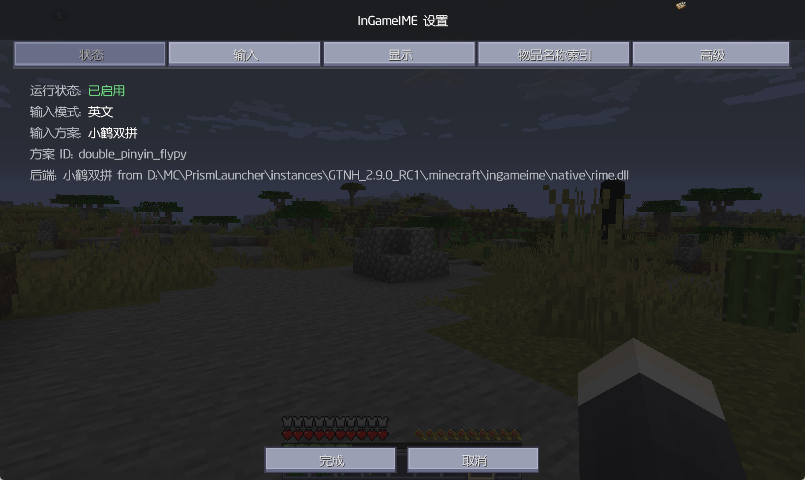

**设置页面2**
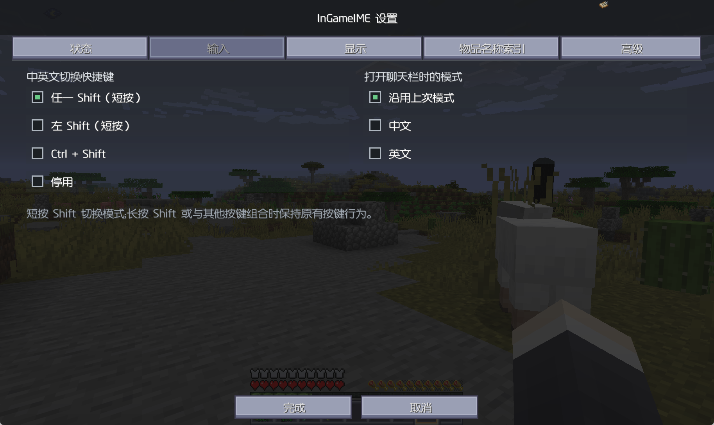

**设置页面3**
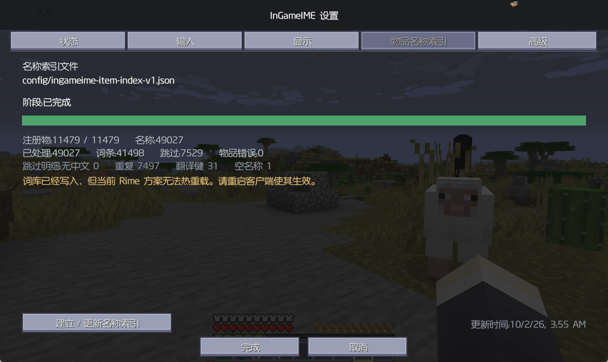

**Rime 候选字窗口样式特写1**
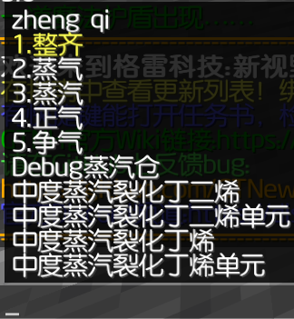

**Rime 候选字窗口样式特写2**

| 模组版本 | 适配 GTNH 版本 | 状态 |
| :--- | :--- | :--- |
| [0.1.2](https://github.com/liansishen/InGameIME/releases/tag/0.1.2) | 2.9.0RC1 | 适配 |

> 🏷️ **当前版本**：[`0.1.2`](https://github.com/liansishen/InGameIME/releases/tag/0.1.2) &nbsp;｜&nbsp; 📥 **直接下载**：[ingameime-0.1.2.jar](https://github.com/liansishen/InGameIME/releases/download/0.1.2/ingameime-0.1.2.jar) &nbsp;｜&nbsp; 📖 **文档**：[安装说明](https://github.com/liansishen/InGameIME#安装) &nbsp;｜&nbsp; 🔗 **链接**：[最新发布](https://github.com/liansishen/InGameIME/releases/latest) · [源码仓库](https://github.com/liansishen/InGameIME)

---

### TomsStorageNH

Tom's Simple Storage 的 1.7.10 移植版，为 GTNH 前期提供轻量集中存储与基础自动化。

- **集中式存储网络**：通过箱子连接器与存储框架将相连容器聚合为统一存储池，支持放置存储终端与绑定无线终端访问。
- **合成终端与 NEI 联动**：合成终端提供九宫格合成区，完整支持 NEI 配方一键转移与自动合成交互。
- **多功能搜索系统**：支持 `@模组名` 筛选与拼音搜索，提供常规、自动聚焦、保留搜索词及 NEI 词条同步四种模式，各玩家状态彼此独立。
- **线缆传输与自动化**：提供线缆与基础漏斗构成的紧凑传输网，支持 10 tick 传输间隔、定向输入输出、物品过滤与红石控制；支持箱子连接器球形范围预览，并提供 Modernity 材质包。

📸 游戏截图预览（点击展开）

 

**简易存储网络中央终端与全局库存访问**
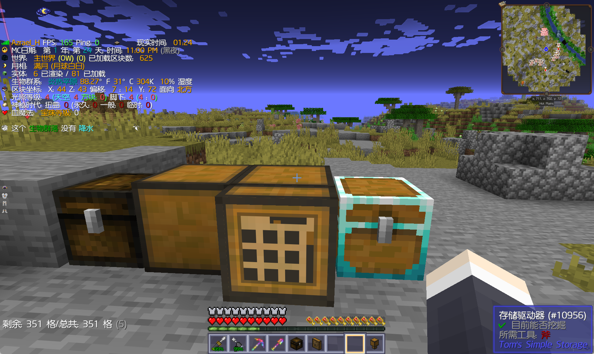

**合成终端**
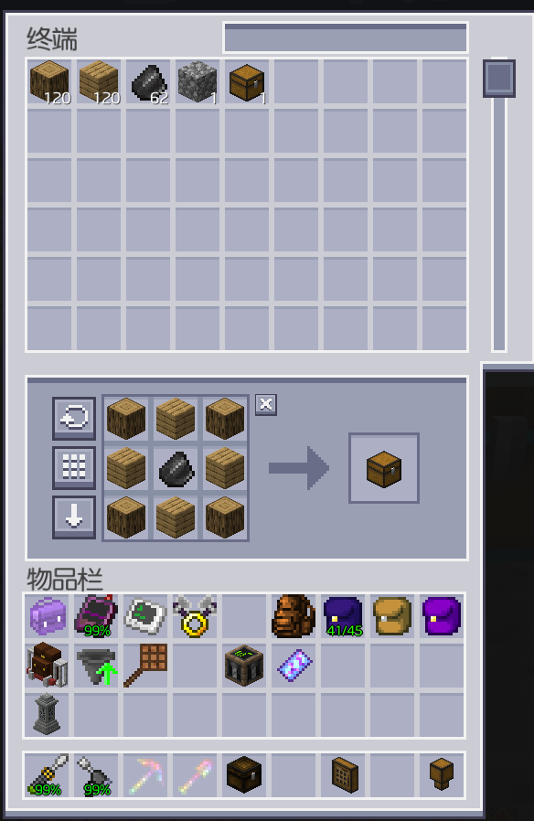

| 模组版本 | 适配 GTNH 版本 | 状态 |
| :--- | :--- | :--- |
| [0.2.5](https://github.com/liansishen/TomsStorageNH/releases/tag/0.2.5) | 2.9.0RC1 | 适配 |

> 🏷️ **当前版本**：[`0.2.5`](https://github.com/liansishen/TomsStorageNH/releases/tag/0.2.5) &nbsp;｜&nbsp; 📥 **直接下载**：[tomsstorage-0.2.5.jar](https://github.com/liansishen/TomsStorageNH/releases/download/0.2.5/tomsstorage-0.2.5.jar) &nbsp;｜&nbsp; 🎨 **材质包**：[Modernity 适配包](https://github.com/liansishen/TomsStorageNH/releases/download/0.2.5/Modernity-TomsStorage-0.2.5.zip) &nbsp;｜&nbsp; 🔗 **链接**：[最新发布](https://github.com/liansishen/TomsStorageNH/releases/latest) · [源码仓库](https://github.com/liansishen/TomsStorageNH)

> 升级到 0.2.5 时，客户端与服务端需同步更新 TomsStorageNH；必需依赖为 GTNHLib、兼容的 GTNH NotEnoughItems 与 UniMixins。Modernity 适配包放入 `resourcepacks`，与 Modernity 同时启用并置于 Modernity 上方。

---

## 版本适配

从各模组当前版本开始统计与 GTNH 整合包版本的适配情况：

| 模组 | 当前版本 | 适配 GTNH 版本 | 状态 |
| :--- | :--- | :--- | :--- |
| **BackpackEnhance** | [0.3.2](https://github.com/liansishen/BackpackEnhance/releases/tag/0.3.2) | 2.9.0RC1 | 适配 |
| **BetterFurnaceNH** | [0.2.3](https://github.com/liansishen/BetterFurnaceNH/releases/tag/0.2.3) | 2.9.0RC1 | 适配 |
| **ClipboardAnywhere** | [0.2.2](https://github.com/liansishen/ClipboardAnywhere/releases/tag/0.2.2) | 2.9.0RC1 | 适配 |
| **EasyTechnology** | [0.5.3](https://github.com/liansishen/EasyTechnology/releases/tag/0.5.3) | 2.9.0RC1 | 适配 |
| **InGameIME** | [0.1.2](https://github.com/liansishen/InGameIME/releases/tag/0.1.2) | 2.9.0RC1 | 适配 |
| **TomsStorageNH** | [0.2.5](https://github.com/liansishen/TomsStorageNH/releases/tag/0.2.5) | 2.9.0RC1 | 适配 |

## 安装说明

1. **模组安装**：将下载的正式版 `.jar` 文件放入对应游戏实例的 `mods` 目录。
2. **材质适配**：若使用 Modernity 适配包，将 `.zip` 放入游戏的 `resourcepacks` 目录；在游戏内启用该包，并将其排序在 Modernity 上方。
3. **环境与依赖**：安装具体模组前，建议查看对应源码仓库的 README，确认所需的前置模组与兼容版本要求。